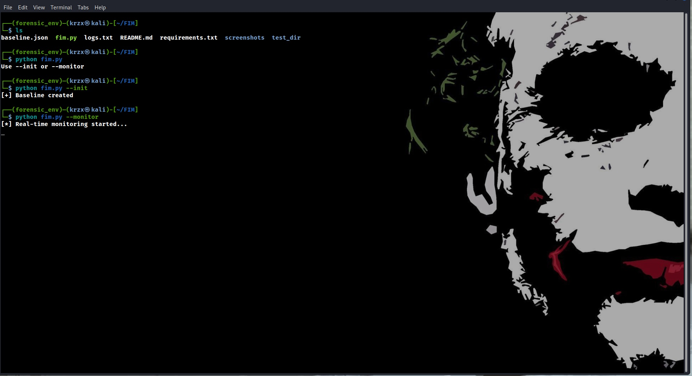
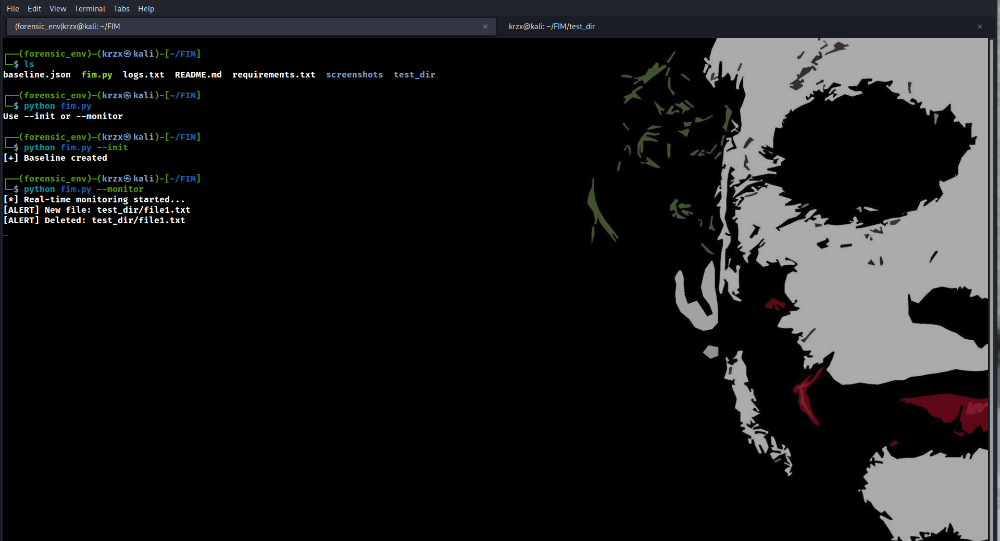
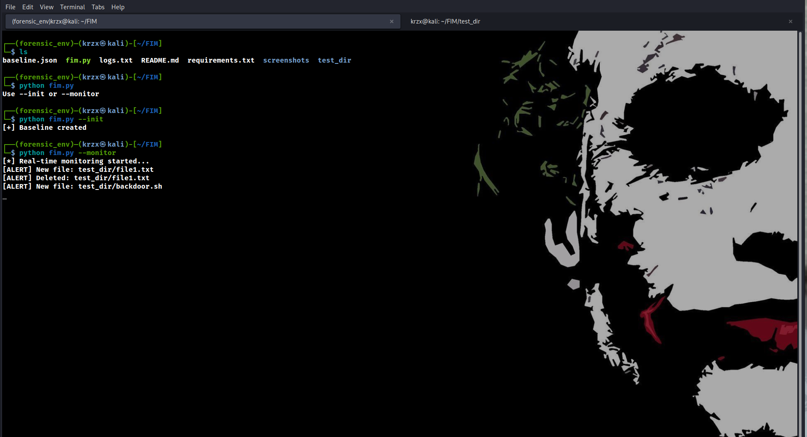

```text
                                                         .-'''-.        .-'''-.          
                                                        '   _    \     '   _    \  .---. 
          .--. __  __   ___                           /   /` '.   \  /   /` '.   \ |   | 
     _.._ |__||  |/  `.'   `.                        .   |     \  ' .   |     \  ' |   | 
   .' .._|.--.|   .-.  .-.   '                    .| |   '      |  '|   '      |  '|   | 
   | '    |  ||  |  |  |  |  | ,.----------.    .' |_\    \     / / \    \     / / |   | 
 __| |__  |  ||  |  |  |  |  |//            \ .'     |`.   ` ..' /   `.   ` ..' /  |   | 
|__   __| |  ||  |  |  |  |  |\\            /'--.  .-'   '-...-'`       '-...-'`   |   | 
   | |    |  ||  |  |  |  |  | `'----------'    |  |                               |   | 
   | |    |__||__|  |__|  |__|                  |  |                               |   | 
   | |                                          |  '.'                             '---' 
   | |                                          |   /                                    
   |_|                                          `'-'                                     
```                                                                       


# 🛡️ File Integrity Monitor (FIM) – DFIR Tool

## 📌 Overview
This project is a **File Integrity Monitoring (FIM)** tool built using Python.  
It detects unauthorized file changes in real-time and is designed for **Digital Forensics and Incident Response (DFIR)** use cases.

The tool monitors a target directory and logs:
- File creation
- File modification
- File deletion

---

## 🎯 Use Case (Why this matters)
In real-world SOC/DFIR environments, attackers often:
- Modify system files
- Drop malicious scripts
- Delete evidence

This tool helps detect:
- Unauthorized file tampering
- Suspicious activity
- Early signs of compromise
---

## ⚙️ Features
- 📂 Real-time directory monitoring
- 🔐 SHA256 hashing for integrity verification
- 📝 Logs all file events
- 🚨 Detects:
  - New files
  - Modified files
  - Deleted files
- 🧩 Cross-platform (Linux & Windows)

## 🏗️ Project Structure

```bash
fim-tool/
│── fim.py
│── baseline.json
│── logs.txt
│── requirements.txt
│── README.md
└── .gitignore
```
## 🛠️ Technologies Used
- Python
- watchdog (file monitoring)
- hashlib (hashing)
- JSON (baseline storage)

---
▶️ Usage
Run the tool:
-----> python fim.py
You will see:

1. Create Baseline
2. Start Monitoring
Step 1: Create Baseline

Stores hash values of files.

Step 2: Start Monitoring

Detects changes in real-time.
---
## 📸 Screenshots

### 🔹 Baseline Creation


### 🔹 Monitoring Started


### 🔹 File Change Detection


### 🔹 Modification Started



## 🚀 Installation
```bash
git clone https://github.com/prajavkrish/fim-tool.git
cd fim-tool
pip install -r requirements.txt
